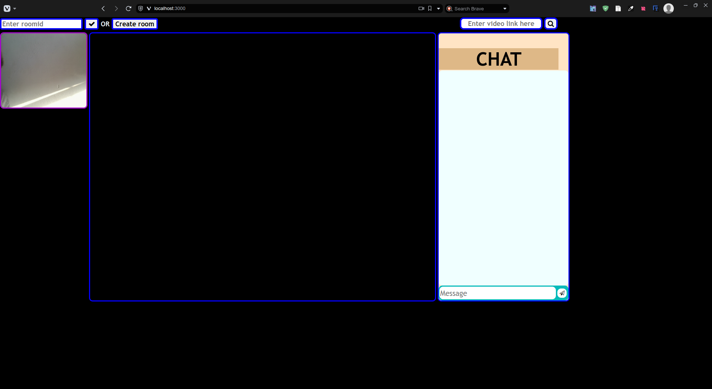
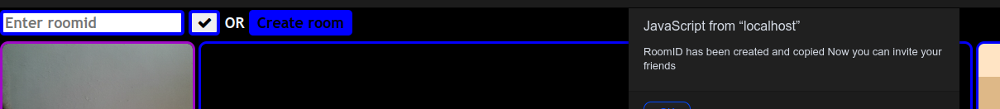
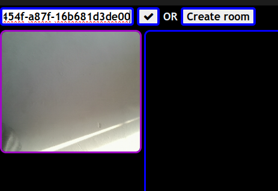
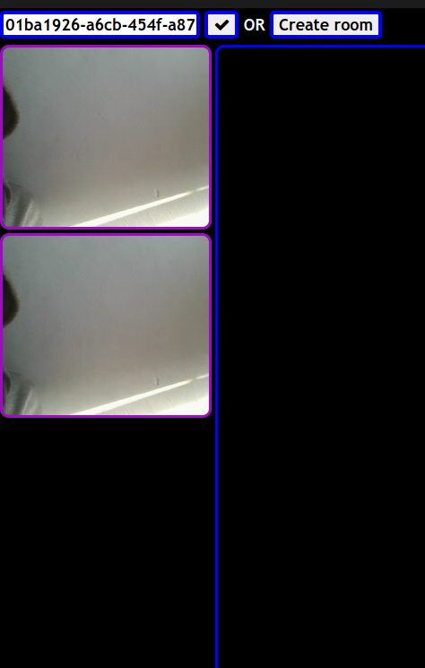
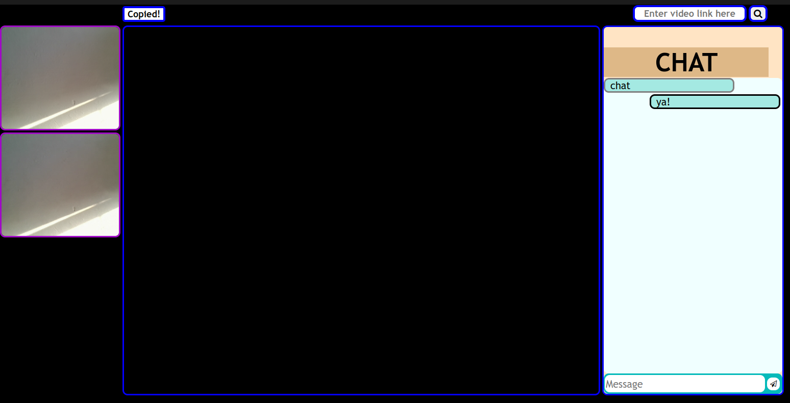
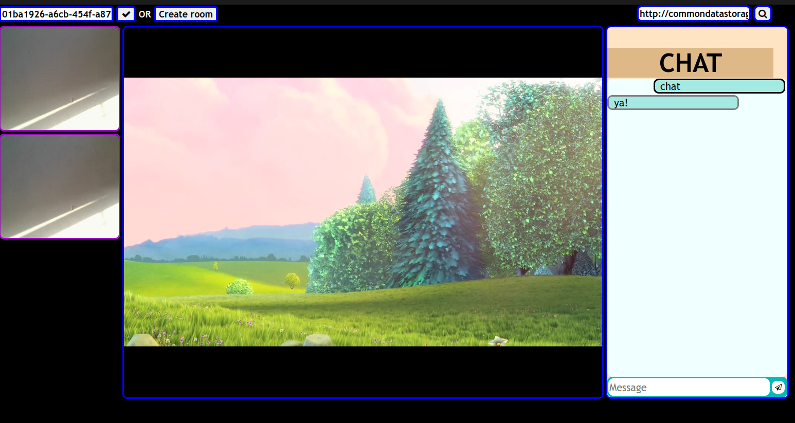

  # Regome (Real time web based straming plateform ) 

It is a Real time web based straming plateform with camera sharing made with help of peerjs ,WebSockets and Html canvas.

## Features and operation

 **Create a Room**: Create a room and get a unique roomID that you can share with your friends. 
**Join a Room** : By pasting another's roomID you can join their room. 
**Video Streaming** : Paste the given link in the given space to load and sync the video .
**Chat feature** : You can chat with your friends using chatbox.

**Tech Stack** :

   * PeerJs and Sockets : To create the connection between the devices and seamlessly stream the cameras and video.  
   * Html canvas: To Buils UI . 
  
## Key Features and Samples
   **Home :**
   
   First look of the web-App
   
    

  **Create Room :**
  
  Create room and get the unique RoomId
  
                               

  **Join Room :**

  Join room using roomid
  
  

 Successfully Joined the Room :

   

**Chat :**

    

**Video Streaming :**

  Enter Link :  
   
   
   
   

  
  
Found any Bugs?? Contact me via runnerofficial00@gmail.com
